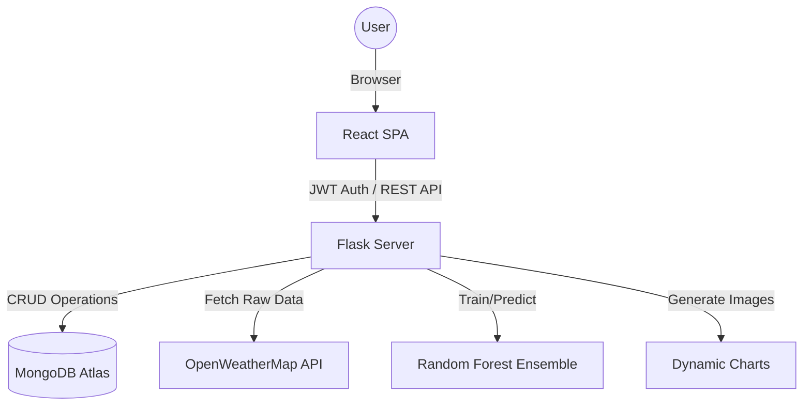

# Project Report: AQI Monitor System

This document provides a comprehensive overview of the **AQI Monitor System**, a full-stack web application designed for real-time air quality monitoring and AI-driven predictive analytics.

## 1. Project Overview & Domain
**Domain**: Environmental Science / Public Health / IoT Data Analytics.
**Project Name**: AQI Monitor (Enviro Monitor)
**Core Objective**: To provide users with high-fidelity, real-time air quality data and reliable AI-based 7-day forecasts to assist in health-conscious decision-making (e.g., outdoor activities, health precautions).

---

## 2. Architecture Diagram (Conceptual)
The system follows a **Client-Server Architecture** with a decoupled frontend and backend.

---

## 3. Technology Stack

### Frontend (Modern Stack)
*   **Framework**: React 19 (Vite)
*   **Animations**: GreenSock (GSAP) for cinematic scroll-architecture, responsive scrub animations, and tactile feedback.
*   **Visual Effects**: OGL / WebGL for a dynamic "Plasma" background with scroll-linked atmospheric color shifts.
*   **Routing**: React Router 7.
*   **Styling**: Custom Vanilla CSS with hardware-accelerated "Glassmorphism" and premium "Tactile" effects.

### Backend (Data & ML Engine)
*   **Framework**: Flask (Python)
*   **Database Connection**: Pymongo (MongoDB Atlas).
*   **Authentication**: JWT (JSON Web Tokens) with `flask-jwt-extended`.
*   **Data Processing**: Numpy, Sklearn.
*   **Visualization**: Matplotlib (Server-side chart generation).
*   **Security**: Werkzeug (Password hashing).

### Data & External Services
*   **Real-time Data**: OpenWeatherMap (Air Pollution API & Geocoding).
*   **Database**: MongoDB Atlas (Cloud NoSQL).

---

## 4. Key Features

### 📡 Real-time Monitoring
*   **Global Coverage**: Search and fetch AQI for any city using OpenWeatherMap.
*   **Live Data**: Real-time concentration levels of **PM2.5, PM10, CO, NO2, and O3**.

### 🤖 AI-Powered Forecasting
*   **7-Day Prediction**: Uses a **Random Forest Regressor** ensemble to predict AQI for the next week.
*   **Feature Engineering**: Includes lag features, rolling statistics, and cyclical encoding for day-of-week patterns.
*   **Confidence Scoring**: Provides a reliability percentage for each prediction based on R² scores and historical data volume.

### 📊 Dynamic Visualizations
*   **Trend Analysis**: 7-day historical vs. 7-day forecasted data.
*   **Pollutant Breakdown**: High-contrast bar charts generated on-the-fly.
*   **Risk Meter**: A color-coded gauge (Good to Hazardous) for instant interpretation.

### 🎨 Premium User Experience
*   **Aesthetic UI**: High-contrast dark theme with premium "Outfit" and "Inter" typography (reverted to stable version for branding).
*   **Atmospheric Backgrounds**: WebGL-powered "Plasma" background that shifts color (Emerald, Amber, Blue) as sections change.
*   **Magnetic Interactivity**: Call-to-action buttons that dynamically pull towards the cursor for a tactile response.
*   **Interactive Glare**: Feature cards with light-tracking glare that follows the user's mouse across the "glass" surface.
*   **Cinematic Scroll**: Optimized GSAP ScrollTrigger architecture with responsive scrub lag for a fluid, lag-free narrative.

---

## 5. Methodology

### Agile & Iterative Development
The project underwent a significant modernization phase:
1.  **Phase 1 (Vanilla)**: Initial prototype using HTML/JS/CSS.
2.  **Phase 2 (Migration)**: Migration to React for component-based modularity and better state management.
3.  **Phase 3 (AI Integration)**: Implementing the backend ML engine and dynamic chart generation.

### Prediction Methodology (The "Brain")
1.  **Data Ingestion**: Historical data is fetched from MongoDB for a specific city.
2.  **Feature Extraction**: The system calculates "lags" (previous days' data), "rolling mean", and "rolling volatility".
3.  **Model Training**: A Random Forest model is fit on normalized features specific to the city's behavior profile.
4.  **Forecasting**: The model generalizes the trend into a 7-day prediction window with realistic "clamping" to avoid data spikes.

---

## 6. Implementation Readiness

| Feature | Status | Technology |
| :--- | :--- | :--- |
| User Auth | ✅ Completed | Flask-JWT + MongoDB |
| Live AQI | ✅ Completed | OpenWeather API |
| ML Engine | ✅ Completed | Scikit-learn + Numpy |
| Charting | ✅ Completed | Matplotlib Agg |
| UI Design | ✅ Premium | GSAP + OGL |

> [!NOTE]
> The project includes a **Robust Simulation Mode**. If MongoDB or API keys are not detected, the system automatically falls back to sophisticated simulation algorithms to ensure the UI remains fully functional for demonstration purposes.
